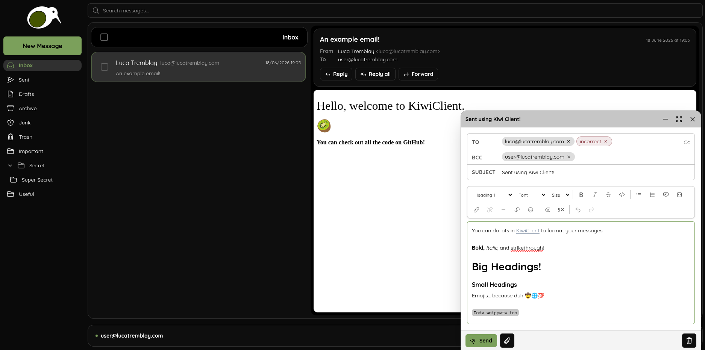

# KiwiClient - a Free and Open Source Web Email Client

**KiwiClient is a web email client written in TypeScript using React and Node licenced under AGPL-3.0.** 

    

## Current Status

KiwiClient is currently in development, you can visit [https://kiwiclient.net](https://kiwiclient.net) to sign-up to the waitlist.

The `main` branch is currently representative of what's hosted on [https://kiwiclient.net](https://kiwiclient.net). The are other branches which are being used for development.

### Developed (Initial Features/Improvements Welcome)
- Login to self-hosted mail servers
- Login to Google (Gmail) accounts
- See all mail in all mailboxes
- Receive mail
- Send mail
- Move mail to different mailboxes/folders (including trash folder)
- Status bar
- And all the UI for these features 

### Currently Being Developed

- UI handling of composing and sending emails (backend in-place).

### Up next for Development
 
- Reply + reply-all + forward 
- Drafts 
- Attachments: receive and send
- Search 
