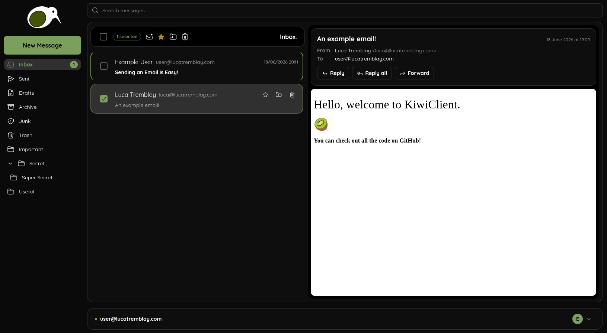

# KiwiClient 
## A Free and Open Source Web Email Client

**KiwiClient is a web email client written in TypeScript using React and Express.JS running in Node.JS licenced under AGPL-3.0.** 

The intent for this project is to develop a fast, modern, and private email
client for primarily self-hosted email clients but with some limited support
for third-party services like Google (Gmail).

    

## Current Status

KiwiClient is currently in development, you can visit [https://kiwiclient.net](https://kiwiclient.net) to sign-up to the waitlist.

The `main` branch is currently representative of what's hosted on [https://kiwiclient.net](https://kiwiclient.net). The are other branches which are being used for development.

#### Development Screenshots

### Developed (Initial Features/Improvements Welcome)
- Login to self-hosted mail servers
- Login to Google (Gmail) accounts
- See all mail in all mailboxes
- Receive mail
- Send mail
- Moving mail to trash
- Status bar
- And all the UI for these features 
- UI handling of composing and sending emails 
- Reply + reply-all + forward 

### Currently Being Developed

- Moving mail to different folders
- Drafts 

### Up next for Development
 
- Attachments: receive and send
- Search 

### Future Stuff

- CRUD of folders
- Mobile compatibility as apps
